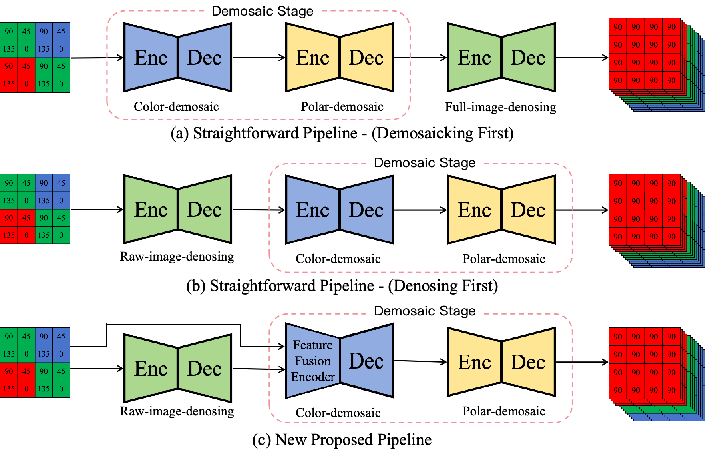
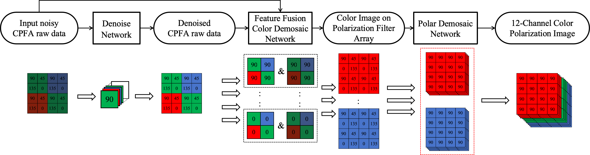
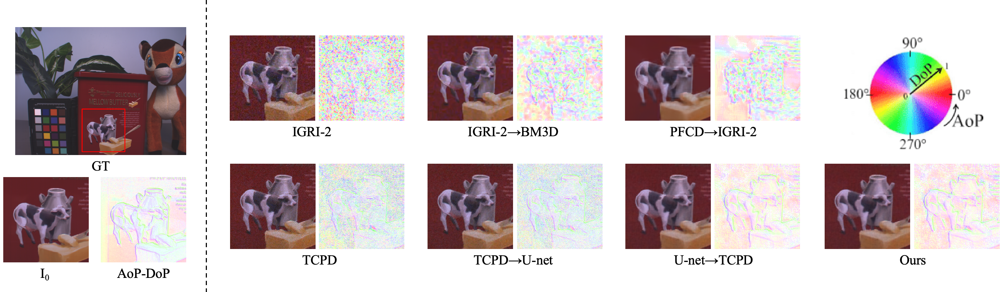

# CPDDNet: Color-Polarization Denoising and Demosaicking Network

Official repository for **CPDDNet**, a joint color-polarization denoising and demosaicking network for CPFA sensors.

Paper: [ICIP2026_Zhang.pdf](assets/ICIP2026_Zhang.pdf) (manuscript version). Its page 1 code-availability statement and `Repo-Link` placeholder are outdated; see the [current release status](#release-status) for what this repository provides.

<p align="center">
  
</p>

## Introduction

Color-polarization filter array (CPFA) sensors capture color texture and polarization information in a single shot, but the raw mosaic data suffer from both noise and missing samples. Existing pipelines usually solve denoising (DN) and demosaicking (DM) separately, which can propagate noise or oversmooth structures needed for polarization recovery.

CPDDNet follows a DN-to-DM design and introduces a feature fusion module to retain raw CPFA information through both stages. This improves reconstructed color-polarization images and polarization parameters under severe noise.

<p align="center">
  
</p>

## Release Status

- [x] **Demo inference:** scripts and a small test dataset are available in `demo/`. Model weights are shared separately.
- [x] **Training code:** the three paper training steps are available in [`train/`](train/README.md).
- [x] **Training datasets:** `FinalDataHigh.zip` and `FinalDmData.zip` are shared in the [Google Drive folder](https://drive.google.com/drive/folders/1Ca-RAS9Vu6enpmZ1bqcF_OMI6MLk0x36?usp=drive_link) alongside the model weights. The archives are not stored in Git.
- [ ] **Evaluation package:** released results and metric computation code will be added later.

## Environment

Python 3.9 or newer is required. Install the dependencies from the repository root:

```bash
python3 -m venv .venv
source .venv/bin/activate
python -m pip install -r requirements.txt
```

On Windows PowerShell, create the environment with `python -m venv .venv` and activate with `.venv\Scripts\Activate.ps1`. The training programs can run on CPU and select CUDA or Apple MPS automatically when available. The demo scripts currently require CUDA or MPS. See the [training guide](train/README.md#1-set-up-python) for a fresh-checkout walkthrough.

## Demo Usage

The five-scene demo dataset is under `demo/data/FinalDataHigh/`. If your checkout contains only `demo/data/FinalDataHigh.zip`, extract it from the repository root first:

```bash
unzip demo/data/FinalDataHigh.zip -d demo/data/
```

Download the required pretrained models from the shared [Google Drive folder](https://drive.google.com/drive/folders/1Ca-RAS9Vu6enpmZ1bqcF_OMI6MLk0x36?usp=drive_link), then place them under this directory at the **repository root**:

```text
CPDDNet/pretrainedModel/
```

The demo scripts load weights from there. `demo_ours.py` requires `Dn_model_raw2raw.pth`, `fusion_tcpd_color_unet_model.pth`, and `finetune_tcpd_polar_unet_model.pth`. The baseline demos require their corresponding DN and TCPDNet weights; check each script's model paths before running it.

Run CPDDNet inference from `demo/`:

```bash
cd demo
python demo_ours.py
```

Outputs are written to:

```text
demo/results/
```

Additional baseline demo scripts are also provided:

```bash
python demo_dm.py
python demo_dndm.py
python demo_dmdn.py
```

## Training from scratch

Run all commands in this section from the **repository root**. If you followed the demo commands above, return there with `cd ..` first. Download `FinalDataHigh.zip` and `FinalDmData.zip` from the same [Google Drive folder](https://drive.google.com/drive/folders/1Ca-RAS9Vu6enpmZ1bqcF_OMI6MLk0x36?usp=drive_link). Each ZIP already contains its dataset's top-level directory, so extract both into `dataset/`:

```bash
mkdir -p dataset
unzip "/path/to/FinalDataHigh.zip" -d dataset/
unzip "/path/to/FinalDmData.zip" -d dataset/
```

Replace the example ZIP paths with your download locations. The result should contain `dataset/FinalDataHigh/input_train/`, `dataset/FinalDataHigh/input_valid/`, and `dataset/FinalDmData/train/` and `valid/`. The small demo dataset cannot replace these training archives. If `dataset/` already contains links to your datasets, skip extraction; the [training guide](train/README.md#2-prepare-the-data) explains how to use those links.

Train the three paper steps in order:

```bash
python train/step1_train_dn.py    # Stage I: RAW denoising
python train/step2_train_dm.py    # Stage I: clean RAW demosaicking
python train/step3_train_gfm.py   # Stage II: train the gated fusion modules
```

Step 3 loads the best checkpoints from Steps 1 and 2 by default. All checkpoints are saved in `train/checkpoints/`, which Git ignores. The detailed [training guide](train/README.md) covers data layout, hardware and batch options, running any step separately, custom checkpoint paths, and resuming training.

## Results

CPDDNet outperforms existing DM-only, DM-to-DN, and DN-to-DM baselines on the high-noise color-polarization dataset used in the paper.

<p align="center">
  
</p>

## Acknowledgement

The evaluation code is modified from [PolarDenDem](https://github.com/ymonno/EARI-Polarization-Demosaicking). Training code is available in this repository; the training datasets and model weights are shared separately through [Google Drive](https://drive.google.com/drive/folders/1Ca-RAS9Vu6enpmZ1bqcF_OMI6MLk0x36?usp=drive_link).
